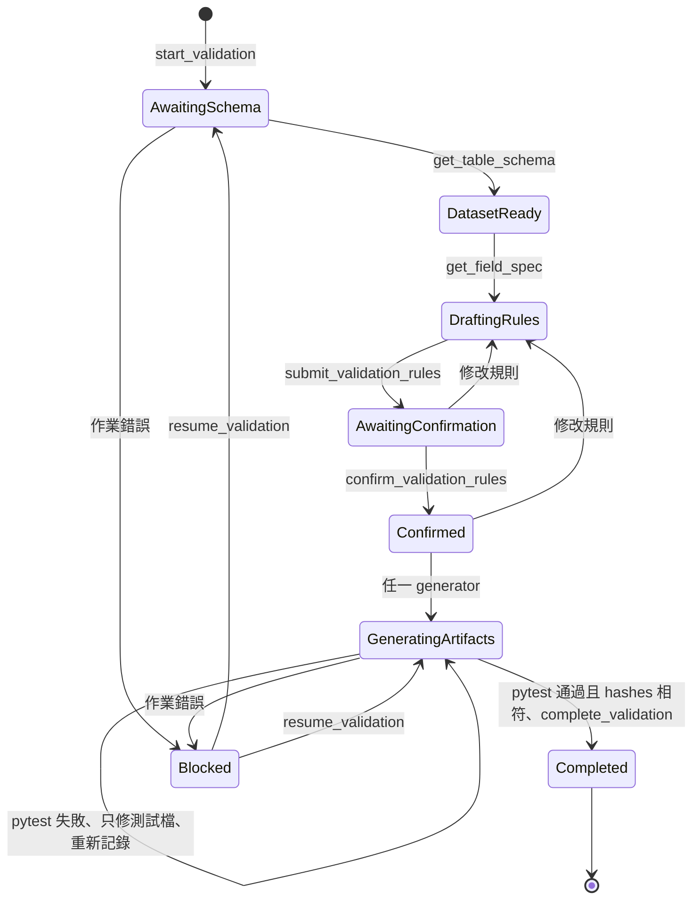

# Data Validation Agent — Agent 套件

本目錄提供 Agent Host 使用的單一 `data-validation` Skill。輸入 DataHub dataset URN 後，
Agent 會與使用者一起確認欄位規則及跨欄位商業規則，最後交付可直接搬入 Airflow ETL repo
的 Pandas validation module 與 pytest。

## Workflow



| 狀態 | 必要條件 | 主要操作 |
| --- | --- | --- |
| `awaiting_schema` | workflow 已保存 dataset URN | `get_table_schema` |
| `dataset_ready` | 已取得 upstream schema | `get_field_spec` |
| `drafting_rules` | 已載入 field-spec contract | 討論 col/row rules；`submit_validation_rules` |
| `awaiting_confirmation` | 完整 rules 已保存 | 分組顯示並等待人工確認 |
| `confirmed` | field spec 與 rules hash 均已確認 | 四個 artifact generators |
| `generating_artifacts` | 至少一個 artifact 已產生 | 產生其餘檔案、凍結 production hash、執行 pytest repair loop |
| `completed` | 四個檔案已寫入、讀回，且使用者環境 pytest 與檔案 hashes 通過 MCP gate | 終止狀態 |

## 確認 Acceptance Criteria

確認畫面必須來自 `get_submitted_validation_rules` 的實際內容，並分為：

1. Column Rules：依欄位分組，每組使用 `<details>` 展開表格。
2. Cross-field Row Rules：獨立 `<details>` 展開完整表格；若沒有規則也明確顯示 0 條。

每列顯示 rule ID、描述、欄位、passing examples 與 failing examples。使用者以自然語言、
SQL 或其他方式提出的 row rule，也必須正規化、提交及顯示後才能被確認。沉默、問題、部分
意見都不算確認；任何修改都要重新提交並再次確認兩組規則。

## 工具順序

| # | 工具 |
| ---: | --- |
| 1 | `start_validation(dataset_urn)` |
| 2 | `get_table_schema(workflow_id)` |
| 3 | `get_field_spec(workflow_id)` |
| 4 | `submit_validation_rules(workflow_id, field_spec_json, row_rules_json)` |
| 5 | `get_submitted_validation_rules(workflow_id)` |
| 6 | 使用者明確確認後執行 `confirm_validation_rules(workflow_id)` |
| 7 | `gen_validation_rules(workflow_id)` |
| 8 | `gen_readme(workflow_id)` |
| 9 | `gen_data_validation(workflow_id, row_impl_code_json)` |
| 10 | `gen_test_data_validation(workflow_id, row_test_code_json)` |
| 11 | 寫入、讀回，在使用者環境執行 pytest；每次呼叫 `record_pytest_result(...)` |
| 12 | pytest 通過後，帶入通過時的 production/test hashes 呼叫 `complete_validation(...)` |

## Artifact 交付

```text
artifacts/{workflow-id}/validation_rules.json
artifacts/{workflow-id}/README.md
artifacts/{workflow-id}/data_validation.py
artifacts/{workflow-id}/test_data_validation.py
```

四個檔案都是必要產物。`validation_rules.json` 是人類確認過的規則契約；README 以中文摘要
及分組表格呈現；runtime 提供 `validate(df)`；pytest 為每條規則提供 pass/fail case，另含空
DataFrame shortcut，不含 execution-failure test。

`data_validation.py` 首次產生後由 MCP 保存 SHA-256，進入 immutable 狀態。pytest 失敗時 Agent
只能修改 `test_data_validation.py`，不得重新產生或修改 production module；每次真實執行結果、
command 與兩個檔案 hashes 都由 `record_pytest_result` 記錄。連續五次失敗會進入 `blocked`，需
人工確認後才能 resume。這是一個由 Skill 執行、MCP state gate 約束的 bounded repair loop。

## POC 限制

- Workflow store 是單一 MCP process 內的全域 map，重啟後遺失且 replica 間不共享。
- 尚未實作持久化、workflow expiry、租戶隔離或具身分驗證的人工核准。
- `examples.sql` 只供 review，不會執行；row-rule Python 由 Agent 按已確認語意產生，並通過
  Server 的 AST 限制後才寫入 module。
