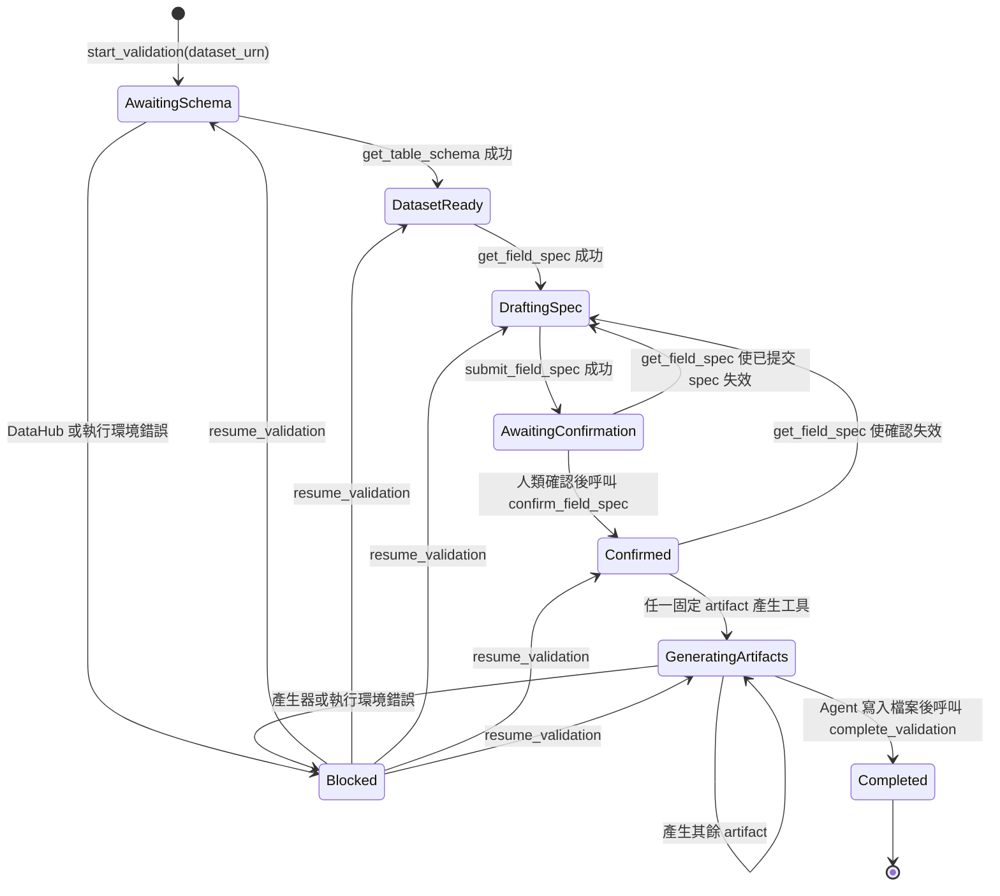

# Data Validation Agent — Agent 套件

本目錄提供 Agent Host 使用的單一入口 Skill。使用者可以明確輸入：

```text
/data-validation urn:li:dataset:(urn:li:dataPlatform:hive,orders,PROD)
```

也可以用自然語言提出 data validation、table validation、field rules、mock data 或
Great Expectations suite 等需求。若沒有 DataHub dataset URN，Agent 會先要求使用者提供。

## 設計

- `data-validation` 是唯一可被 Agent Host 發現及使用者呼叫的 Skill。
- 原本的四個階段已改為 `references/`，沒有 Skill frontmatter，不是獨立入口。
- 不再部署額外 `SYSTEM_PROMPT.md`；角色、流程、限制條件與觸發規則都由單一 Skill 定義。
- MCP Server 以行程內的全域 map 保存 workflow state、上游 schema、正式版
  `field_spec`、確認紀錄與 artifact 狀態。
- Agent Host 只保存 MCP 回傳的 artifact 到使用者 workspace；MCP Server 不保存 artifact
  檔案。

```text
agent/skills/data-validation/
├── SKILL.md
└── references/
    ├── dataset-intake.md
    ├── field-spec.md
    ├── confirmation-gate.md
    ├── artifact-delivery.md
    └── state-machine.md
```

## 狀態機

每次呼叫 `start_validation(dataset_urn)` 都會建立新的 `workflow_id`，格式為
`dva_{YYYYMMDD}_{四碼亂數}`，日期使用 UTC。Server 會在目前 process 內遇到碰撞時探查下一個
四碼 suffix，確保 ID 唯一。後續所有 MCP tools 必須使用同一個 ID；Server 會拒絕不符合
目前 state 的操作。



### 各狀態的不變條件

| 狀態 | 必要條件 | 可執行的主要操作 |
| --- | --- | --- |
| `awaiting_schema` | 已建立 workflow 並保存 dataset URN | `get_table_schema` |
| `dataset_ready` | upstream schema 已成功取得 | `get_field_spec` |
| `drafting_spec` | 已載入最新 field-spec contract | `submit_field_spec` |
| `awaiting_confirmation` | 正式版 field spec 已驗證並保存 | 人工審閱、`confirm_field_spec` |
| `confirmed` | confirmation hash 等於目前 spec hash | artifact generators |
| `generating_artifacts` | 至少一個產生器已成功 | 產生其餘固定 artifacts；三個完成後執行 `complete_validation` |
| `blocked` | 保存錯誤與原本的恢復 state | 修正後執行 `resume_validation` |
| `completed` | 三個固定 artifacts 已寫入並由 Agent 驗證 | 終止狀態 |

任何已提交、已確認或正在產生 artifacts 的 spec 只要重新進入 `get_field_spec`，既有確認、
產生與交付狀態都會失效。

## 人工確認關卡

Agent 必須先顯示：

- `workflow_id` 與 `table_name`
- 完整的共通規則表
- 完整的資料型別專屬規則表
- 所有中／低信心的假設與剩餘風險

使用者只需要清楚回覆「確認」、「可以」、「沒問題」、`confirm` 等肯定語句。Agent 收到回覆
後才可呼叫 `confirm_field_spec(workflow_id)`。

POC 的 MCP Server 能強制 state transition 與已確認 spec 的 hash，但無法單從 MCP protocol
證明呼叫確認 tool 的一定是人類。若未來需要不可偽造的人工核准，應加入具身分驗證的核准
介面或簽章核准 token。

## MCP 工具執行順序

| 順序 | 工具 | 狀態轉換 |
| --- | --- | --- |
| 1 | `start_validation(dataset_urn)` | 建立 `awaiting_schema` |
| 2 | `get_table_schema(workflow_id)` | `awaiting_schema → dataset_ready` |
| 3 | `get_field_spec(workflow_id)` | `dataset_ready → drafting_spec` |
| 4 | `submit_field_spec(workflow_id, field_spec_json)` | `drafting_spec → awaiting_confirmation` |
| 5 | `confirm_field_spec(workflow_id)` | `awaiting_confirmation → confirmed` |
| 6 | `gen_validation_suite(workflow_id)` | `confirmed → generating_artifacts` |
| 7 | `gen_mock_data(workflow_id)` | 維持 `generating_artifacts` |
| 8 | `gen_field_spec_csv(workflow_id)` | 維持 `generating_artifacts` |
| 9 | `complete_validation(workflow_id, suite_path, mock_path, field_spec_path)` | `generating_artifacts → completed` |

`get_validation_state` 可讀取狀態；`resume_validation` 只用於修正作業錯誤後恢復
`blocked` workflow。

## Artifact 交付

Artifact 只寫入使用者 workspace：

```text
artifacts/{workflow-id}/<table_name>_validation_suite.json
artifacts/{workflow-id}/<table_name>_mock.csv
artifacts/{workflow-id}/<table_name>_field_spec.csv
```

三個檔案都是必要產物，不詢問使用者是否需要 mock data，也不開放指定筆數。Mock CSV 只包含
反向資料，每列至少違反一條規則；基準為 100 筆，為覆蓋全部可產生的條件可增加至最多
1000 筆。超過上限的案例會截斷，不阻擋 artifact 交付。

Field-spec CSV 將全部屬性展開為 columns，每個資料欄位各占一 row，方便使用者後續比對。

Agent 必須讀回驗證寫入內容，再以 workspace-relative path 呼叫 `complete_validation`。MCP
Server 只記錄 path 與 delivery status。

## POC 限制

- Workflow store 是單一 MCP 行程內的全域 map。
- Server 或 container 重啟後資料會遺失，多個 replica 之間也不共享 state。
- 尚未實作 workflow 過期、持久化、租戶隔離或具身分驗證的人工核准。
- 此版本應使用單一 MCP replica；正式環境需改為共享持久化儲存。

## 部署

Agent Host 只需載入 `agent/skills/data-validation/`，並連線至 Data Validation MCP Server。
不要再設定舊的 `SYSTEM_PROMPT.md` 或安裝四個 phase skills。

部署後確認 Agent Host 能發現 `data-validation` Skill，以及 MCP Server 的 workflow tools。
